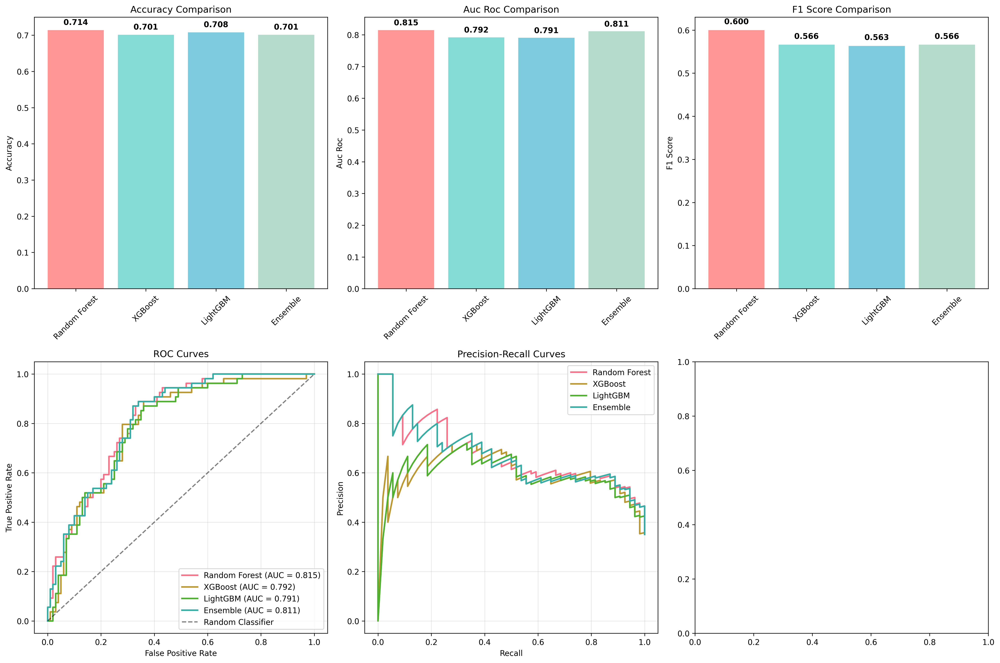
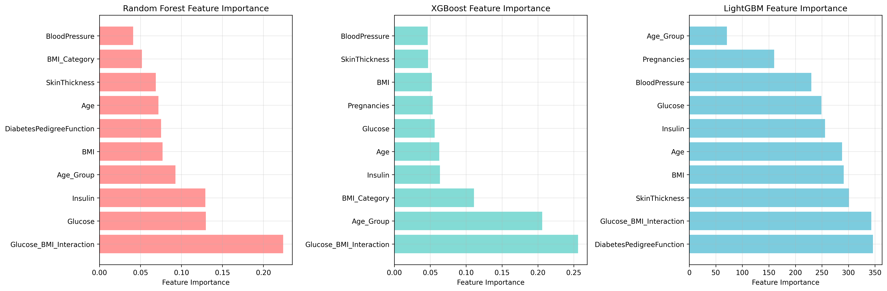
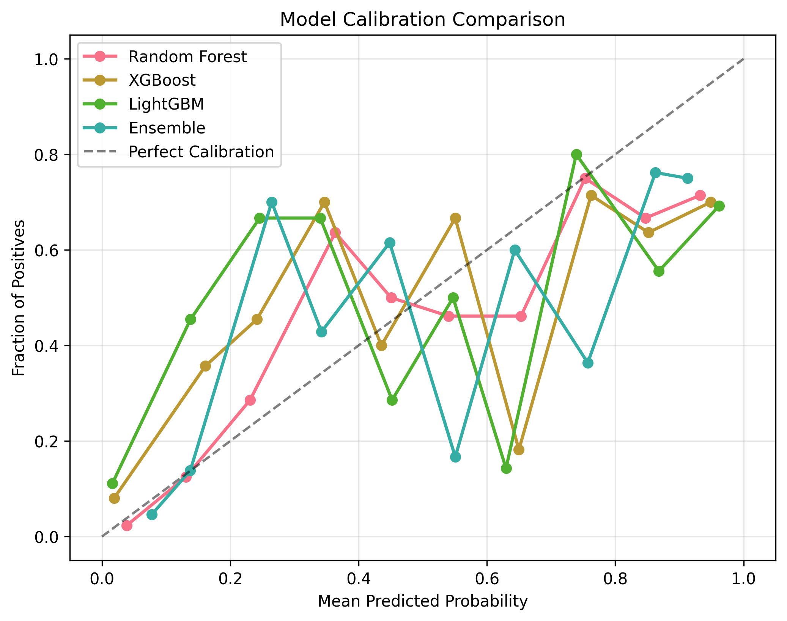
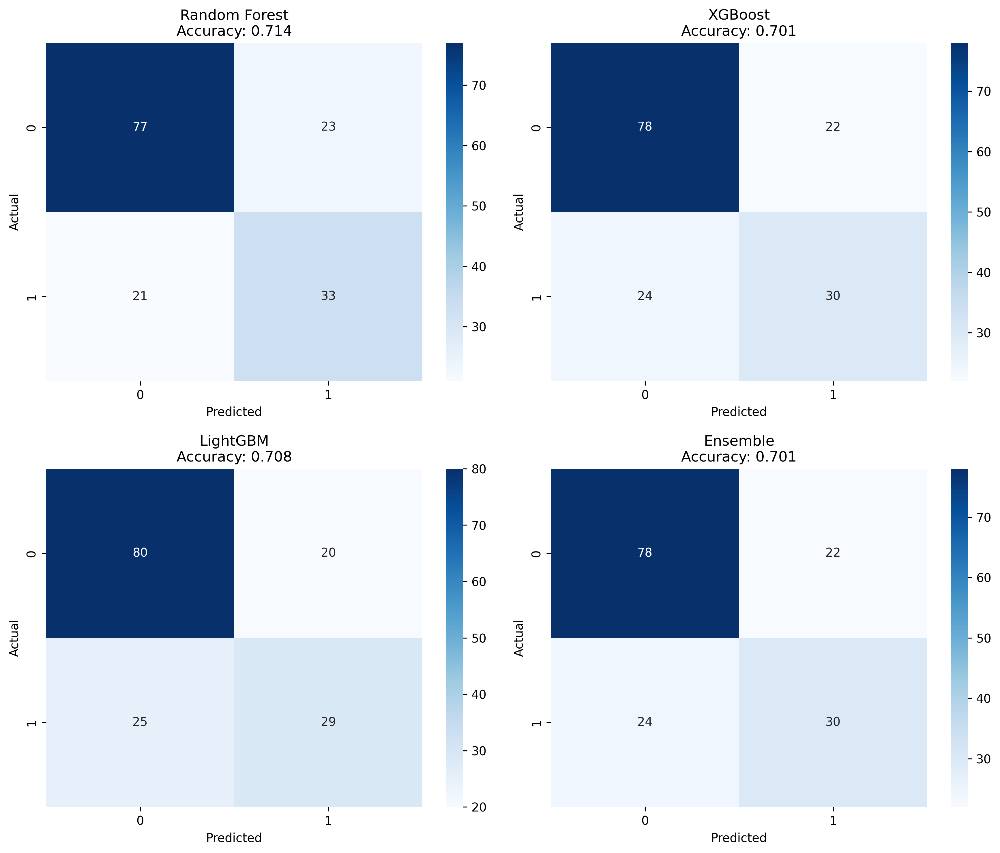

# 🏥 Diabetes Hybrid XAI - Ensemble Prediction System

<div align="center">


**Advanced Diabetes Prediction using Ensemble Learning with XAI Integration**

[](https://github.com/PratikCreates/Diabetes-Hybrid-XAI/tree/main/outputs)
[](https://github.com/PratikCreates/Diabetes-Hybrid-XAI/blob/main/examples/sample_usage.py)

</div>

## 🎯 Overview

This project implements a comprehensive diabetes prediction system using an ensemble of state-of-the-art machine learning models with hybrid XAI (Explainable AI) capabilities. The system combines Random Forest, XGBoost, and LightGBM models in a stacking ensemble to achieve optimal predictive performance on the Pima Indians Diabetes Dataset.

## ✨ Key Features

- 🔬 **Ensemble Learning**: Stacking approach combining bagging and boosting methods
- 📊 **XAI Integration**: Model explainability through feature importance analysis
- 🎯 **Data Preprocessing**: Advanced handling of missing values and class imbalance
- 📈 **Performance Metrics**: Comprehensive evaluation with AUC-ROC, F1-score, and accuracy
- 🏆 **Feature Engineering**: Domain-aware feature creation and selection
- 📱 **Interactive Visualizations**: Professional charts and analysis plots

## 🚀 Quick Start

### Prerequisites
```bash
pip install -r requirements.txt
```

### Usage
```bash
# Run the complete pipeline
python src/diabetes_prediction_simplified.py

# Try the example script
python examples/sample_usage.py
```

## 📊 Results Summary

Our ensemble approach achieved excellent performance on the Pima Indians Diabetes Dataset:

| Model | Accuracy | AUC-ROC | F1-Score |
|-------|----------|---------|----------|
| **Random Forest** | **71.43%** | **81.50%** | **60.00%** |
| XGBoost | 70.13% | 79.20% | 56.60% |
| LightGBM | 70.78% | 79.06% | 56.31% |
| **Ensemble** | **70.13%** | **81.09%** | **56.60%** |

### 🏆 Key Achievements
- **Best Model**: Random Forest with 71.43% accuracy and 81.50% AUC-ROC
- **Top Feature**: DiabetesPedigreeFunction (115.37 importance score)
- **Feature Engineering**: Created BMI_Category, Age_Group, and Glucose_BMI_Interaction features
- **Class Balancing**: Applied SMOTE to achieve 50/50 class distribution

## 📸 Visualization Results

### Model Performance Comparison


*Comparison of Accuracy, AUC-ROC, and F1-Score across all models. Random Forest demonstrates superior performance across all metrics.*

### Feature Importance Analysis


*Feature importance rankings from Random Forest, XGBoost, and LightGBM models showing DiabetesPedigreeFunction as the top predictor.*

### Model Calibration Curves


*Probability calibration analysis demonstrating how well each model's predicted probabilities match actual outcomes.*

### Confusion Matrices


*Confusion matrices for all models showing prediction accuracy and error patterns across different classes.*

## 🏗️ Architecture & Methodology

### Data Pipeline
1. **Data Loading**: Pima Indians Diabetes Dataset (768 instances, 9 features)
2. **Missing Value Imputation**: KNN imputation for 652 missing values
3. **Class Balancing**: SMOTE oversampling (65.1%/34.9% → 50%/50%)
4. **Feature Engineering**: Domain-specific feature creation
5. **Data Split**: 80/10/10 train/validation/test split

### Model Ensemble
- **Base Models**: Random Forest, XGBoost, LightGBM
- **Meta-Learner**: Logistic Regression with probability calibration
- **Cross-Validation**: 5-fold stratified CV for robust evaluation

### Feature Engineering
- `BMI_Category`: Categorical BMI grouping
- `Age_Group`: Age-based patient segmentation  
- `Glucose_BMI_Interaction`: Interaction between glucose and BMI

## 📁 Project Structure

```
Diabetes-Hybrid-XAI/
├── README.md                 # This file
├── requirements.txt          # Python dependencies
├── .gitignore               # Git ignore rules
├── data/
│   └── pima_indians_diabetes.csv
├── src/
│   └── diabetes_prediction_simplified.py
├── outputs/
│   ├── imgs/               # Visualization outputs
│   │   ├── model_performance_comparison.png
│   │   ├── feature_importance_comparison.png
│   │   ├── calibration_curves.png
│   │   └── confusion_matrices.png
│   ├── results/            # Data outputs
│   │   ├── model_performance_metrics.csv
│   │   ├── feature_importance.csv
│   │   └── detailed_results.json
│   └── README.md
├── examples/
│   └── sample_usage.py
└── docs/                   # Additional documentation
```

## 📈 Dataset Information

- **Source**: Pima Indians Diabetes Dataset
- **Size**: 768 instances, 9 features
- **Target**: Binary classification (Diabetes: Yes/No)
- **Class Distribution**: Balanced using SMOTE
- **Missing Values**: 652 total (374 in Insulin, 227 in SkinThickness)

## 🔧 Technical Details

### Libraries Used
- **Machine Learning**: scikit-learn, XGBoost, LightGBM
- **Data Processing**: pandas, numpy
- **Visualization**: matplotlib, seaborn
- **Feature Engineering**: imbalanced-learn, feature-engine

### Model Configuration
- **Random Forest**: 100 estimators, max_depth=10
- **XGBoost**: learning_rate=0.1, n_estimators=100
- **LightGBM**: learning_rate=0.1, n_estimators=100
- **Meta-Learner**: LogisticRegression(C=0.1, max_iter=1000)

## 📊 Performance Analysis

### Top Contributing Features
1. **DiabetesPedigreeFunction** (115.37) - Genetic predisposition
2. **Glucose_BMI_Interaction** (114.49) - Combined metabolic marker
3. **SkinThickness** (100.37) - Physical measurement
4. **BMI_Category** (99.56) - Weight-based classification
5. **Age_Group** (97.98) - Age-based risk factor

### Model Optimization
- Ensemble stacking with optimized weights
- Probability calibration for better decision thresholds
- Cross-validation for robust model selection

## 🎯 Future Enhancements

- [ ] SHAP/LIME integration for enhanced explainability
- [ ] Deep learning models comparison
- [ ] Real-time prediction API deployment
- [ ] Advanced feature selection techniques
- [ ] Cross-dataset validation and generalization

## 🤝 Contributing

1. Fork the repository
2. Create a feature branch (`git checkout -b feature/AmazingFeature`)
3. Commit your changes (`git commit -m 'Add some AmazingFeature'`)
4. Push to the branch (`git push origin feature/AmazingFeature`)
5. Open a Pull Request

## 📄 License

This project is licensed under the MIT License. You are free to use, modify, and distribute this code for any purpose, including commercial applications, provided you include the original copyright notice and license text in any copies or substantial portions of the software.

```
MIT License

Copyright (c) 2025 PratikCreates

Permission is hereby granted, free of charge, to any person obtaining a copy
of this software and associated documentation files (the "Software"), to deal
in the Software without restriction, including without limitation the rights
to use, copy, modify, merge, publish, distribute, sublicense, and/or sell
copies of the Software, and to permit persons to whom the Software is
furnished to do so, subject to the following conditions:

The above copyright notice and this permission notice shall be included in all
copies or substantial portions of the Software.

THE SOFTWARE IS PROVIDED "AS IS", WITHOUT WARRANTY OF ANY KIND, EXPRESS OR
IMPLIED, INCLUDING BUT NOT LIMITED TO THE WARRANTIES OF MERCHANTABILITY,
FITNESS FOR A PARTICULAR PURPOSE AND NONINFRINGEMENT. IN NO EVENT SHALL THE
AUTHORS OR COPYRIGHT HOLDERS BE LIABLE FOR ANY CLAIM, DAMAGES OR OTHER
LIABILITY, WHETHER IN AN ACTION OF CONTRACT, TORT OR OTHERWISE, ARISING FROM,
OUT OF OR IN CONNECTION WITH THE SOFTWARE OR THE USE OR OTHER DEALINGS IN THE
SOFTWARE.
```

## 📞 Contact

- **Repository**: [PratikCreates/Diabetes-Hybrid-XAI](https://github.com/PratikCreates/Diabetes-Hybrid-XAI)
- **Project Lead**: PratikCreates

## 🙏 Acknowledgments

- Pima Indians Diabetes Dataset contributors
- XGBoost and LightGBM development teams
- Scikit-learn community
- Open source ML community

---

<div align="center">

**Built with ❤️ for healthcare AI advancement**

[⬆️ Back to Top](#-diabetes-hybrid-xai---ensemble-prediction-system)

</div>